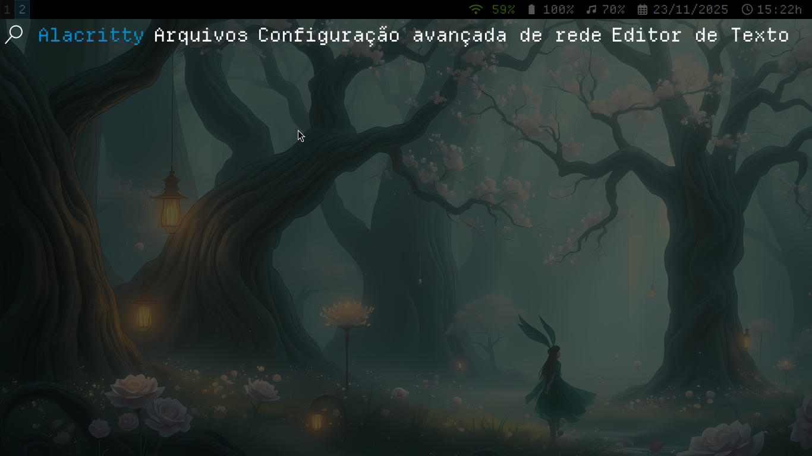
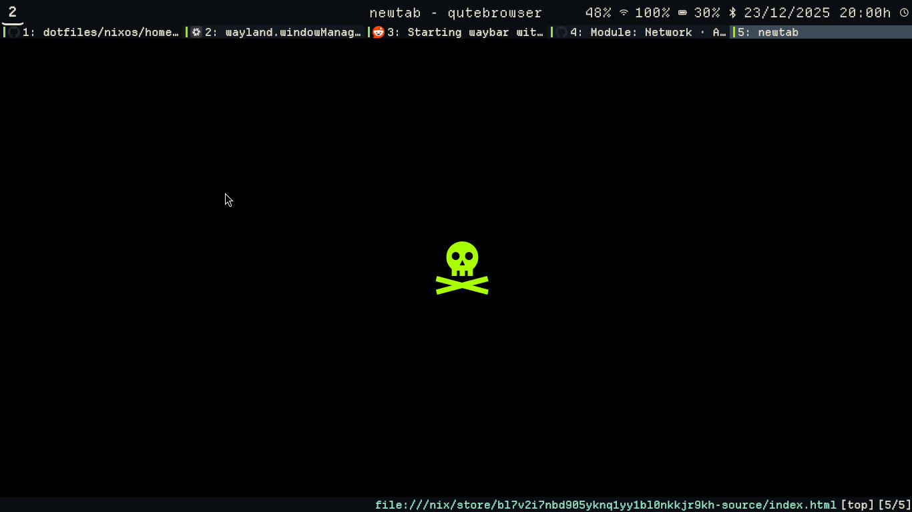

# ❄️ NixOS Config

*Anybody is free to use, modify or look into the code!*

## Table of Contents
- [Overview](#overview)
- [Questions & Answers](#questions--answers)
  - [Why Home Manager Won't Build?](#why-home-manager-wont-build)
  - [How is Limine Declared but Not Installed on Rebuild?](#how-is-limine-declared-but-not-installed-on-rebuild)
  - [How to Change the Wallpaper?](#how-to-change-the-wallpaper)
  - [What Keybindings should I Know?](#what-keybindings-should-i-know)
  - [Can I Select Software?](#can-i-select-software)

## Overview

Organized through the power of Home Manager, flakes, and GitHub referencing, even the wallpaper is fully declarative.

Personal quickmarks are declared. The [startpage](https://github.com/notawyvern/startpage) is too and refers to a repository itself. Home Manager allows deep tweaking into apps, both on CLI and GUI. Vi mode on Bash is enabled by default. And these things are just the tip of the iceberg.

## Questions & Answers

### Why Home Manager Won't Build?

Probably your dotfiles are getting in the way. I suggest moving them to the .bak format for using later on. 

### How is Limine Declared but Not Installed on Rebuild?

Make sure your system is pointing to its EFI file in order to boot. You can do so through your firmware vendor, the BIOS/UEFI, or by using [efibootmgr](https://wiki.archlinux.org/title/Unified_Extensible_Firmware_Interface#efibootmgr).

### How to Change the Wallpaper?

The file [sway.nix](./nixos/pkgs/hmpkgs/desktop/sway/sway.nix) references it. You could just change the line. The built-in one checks in the ~/.wallpapers folder, which will be generated if you rebuild NixOS. It fetches my wallpaper repo from GitHub and copies some really nice images to the /nix/store. I'd suggest to take a look.

### What Keybindings should I Know?

The Windows or the Super key is used as Mod (modifier). The following keys are the most important.

- **Mod+b**: opens qutebrowser
- **Mod+d**: opens tofi menu (an app chooser alternative to dmenu)
- **Mod+t**: opens the alacritty terminal
- **Mod+q**: closes the currently focused window
- **Mod+number**: changes the workspace
- **Mod+Shift+e**: quits sway back to gtkgreet

### Can I Select Software?

The majority of the packages are declared in [homemgr](./nixos/homemgr) and [syspkgs](./nixos/syspkgs). Cherry picking them might save some bandwidth and time when rebuilding NixOS. It is a wise measure, since the deployment can be faster.

The directory [pkgs](./nixos/homemgr/pkgs) contain mostly software I find non-essential. Though it still has a few important ones. They are the following:

- FreeTube
- VSCodium
- fastfetch
- ruffle
- KolourPaint
- Spotube + ytdlp
- Upscayl
- VirtualBox
- Vim
- htop
- Bash (as in Home Manager)
- git
- Qalculate!'s GTK version
- Cosmic Edit and Cosmic Files
- iwgtk
- sioyek (a pdf viewer)
- swayimg to view images
- Alacritty as a terminal emulator

You can be a minimalist and get rid of what is relevant, including by removing it elsewhere, but this is an untested route. The beauty of Linux is that you can do whatever you want. If so, you still can use some reference.
